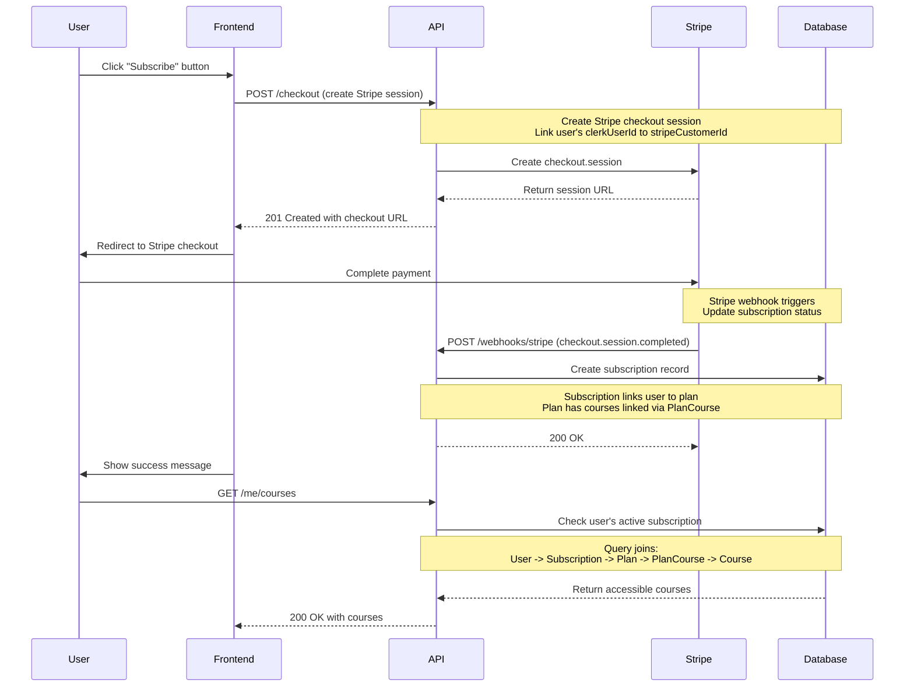
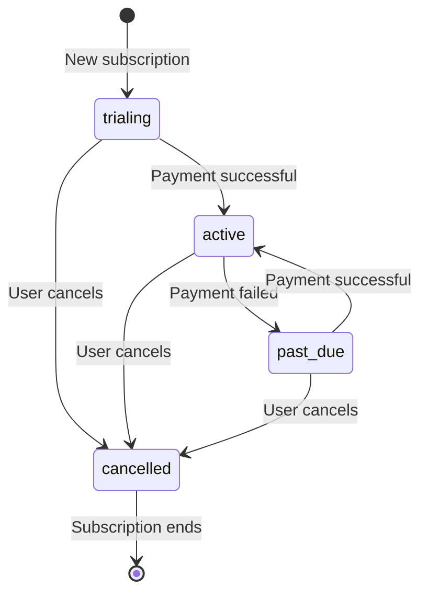

# Subscription Flow

## Overview

This flow describes how users subscribe to plans and gain access to courses.



## Step-by-Step

### 1. Create Checkout Session

The frontend initiates checkout:

```typescript
// Frontend code
const response = await fetch('http://localhost:3000/checkout', {
  method: 'POST',
  headers: {
    'Authorization': `Bearer ${clerkJwtToken}`,
    'Content-Type': 'application/json'
  },
  body: JSON.stringify({
    planId: 'a1b2c3d4-e5f6-7890-abcd-ef1234567890'
  })
})

const { checkoutUrl } = await response.json()
window.location.href = checkoutUrl
```

### 2. API Creates Stripe Session

```typescript
// src/routes/checkoutRoutes.ts (hypothetical)
router.post('/checkout', async (req, res) => {
  const { userId } = getAuth(req)
  
  // Validate user exists
  const user = await db.user.findUnique({ where: { clerkUserId: userId } })
  if (!user) {
    return res.status(404).json({ success: false, error: 'User not found' })
  }
  
  // Get plan
  const { planId } = CreateCheckoutBody.parse(req.body)
  const plan = await db.plan.findUnique({ where: { id: planId } })
  if (!plan) {
    return res.status(404).json({ success: false, error: 'Plan not found' })
  }
  
  // Create Stripe checkout session
  const stripeSession = await stripe.checkout.sessions.create({
    customer: user.stripeCustomerId || undefined,
    customer_email: user.email,
    line_items: [{
      price: plan.stripePriceId!,
      quantity: 1
    }],
    mode: 'subscription',
    success_url: `${process.env.FRONTEND_URL}/success`,
    cancel_url: `${process.env.FRONTEND_URL}/cancel`
  })
  
  res.status(201).json({ checkoutUrl: stripeSession.url })
})
```

### 3. Stripe Webhook Updates Subscription

```typescript
// src/routes/webhookRoutes.ts (hypothetical)
router.post('/webhooks/stripe', internalApiKey, async (req, res) => {
  const event = stripe.webhooks.constructEvent(
    req.body,
    req.headers['stripe-signature'],
    process.env.STRIPE_WEBHOOK_SECRET!
  )
  
  if (event.type === 'checkout.session.completed') {
    const session = event.data.object
    
    // Find user by email or customer ID
    const user = await db.user.findFirst({
      where: {
        OR: [
          { email: session.customer_email! },
          { stripeCustomerId: session.customer as string }
        ]
      }
    })
    
    if (user) {
      // Create subscription record
      await db.subscription.create({
        data: {
          userId: user.id,
          planId: session.metadata.planId,
          stripeCustomerId: session.customer as string,
          stripeSubscriptionId: session.subscription as string,
          status: 'active',
          currentPeriodStart: new Date(session.current_period_start * 1000),
          currentPeriodEnd: new Date(session.current_period_end * 1000)
        }
      })
    }
  }
  
  res.status(200).json({ received: true })
})
```

### 4. User Accesses Courses

```typescript
// src/services/userCoursesService.ts
const courseSelect = {
  id: true,
  title: true,
  description: true,
  thumbnail: true,
  sortOrder: true
} as const

function activeSubscriptionFilter(clerkUserId: string) {
  const now = new Date()
  return {
    user: { clerkUserId },
    status: { in: ['active', 'trialing'] as const },
    AND: [
      { OR: [{ currentPeriodStart: null }, { currentPeriodStart: { lte: now } }] },
      { OR: [{ currentPeriodEnd: null }, { currentPeriodEnd: { gte: now } }] }
    ]
  }
}

export async function getUserCourses(clerkUserId: string, limit: number, offset: number) {
  const where = {
    isPublished: true,
    planCourses: {
      some: {
        plan: {
          subscriptions: {
            some: activeSubscriptionFilter(clerkUserId)
          }
        }
      }
    }
  }
  
  const [courses, total] = await Promise.all([
    db.course.findMany({
      where,
      select: courseSelect,
      take: limit,
      skip: offset
    }),
    db.course.count({ where })
  ])
  
  return { courses, total }
}
```

## Query Breakdown

The `getUserCourses` query joins multiple tables:

```prisma
// SQL equivalent
SELECT c.id, c.title, c.description, c.thumbnail, c.sort_order
FROM courses c
INNER JOIN plan_courses pc ON c.id = pc.course_id
INNER JOIN plans p ON pc.plan_id = p.id
INNER JOIN subscriptions s ON p.id = s.plan_id
INNER JOIN users u ON s.user_id = u.id
WHERE c.is_published = true
  AND s.status IN ('active', 'trialing')
  AND u.clerk_user_id = '<user-id>'
  AND (s.current_period_start IS NULL OR s.current_period_start <= NOW())
  AND (s.current_period_end IS NULL OR s.current_period_end >= NOW())
```

## Request/Response Examples

### Create Checkout Session

**Request**:
```bash
curl -X POST http://localhost:3000/checkout \
  -H "Authorization: Bearer <clerk-jwt-token>" \
  -H "Content-Type: application/json" \
  -d '{
    "planId": "a1b2c3d4-e5f6-7890-abcd-ef1234567890"
  }'
```

**Response (201 Created)**:
```json
{
  "checkoutUrl": "https://checkout.stripe.com/c/pay/cs_test_abc123"
}
```

### Get User Courses (After Subscription)

**Request**:
```bash
curl -H "Authorization: Bearer <clerk-jwt-token>" \
  "http://localhost:3000/me/courses"
```

**Response (200 OK)**:
```json
{
  "success": true,
  "data": [
    {
      "id": "b2c3d4e5-f6a7-8901-bcde-f12345678901",
      "title": "Advanced Editing Techniques",
      "description": "Master advanced editing skills",
      "thumbnail": "https://example.com/thumb2.jpg",
      "sortOrder": 1
    }
  ],
  "pagination": {
    "total": 1,
    "limit": 10,
    "offset": 0,
    "hasMore": false
  }
}
```

## Subscription Status Flow



## Key Points

1. **Stripe Integration**: Uses Stripe Checkout for payment handling
2. **Webhook Processing**: Async subscription creation via webhooks
3. **Access Control**: Course access based on active subscription status
4. **Period Tracking**: Tracks billing periods for accurate access control