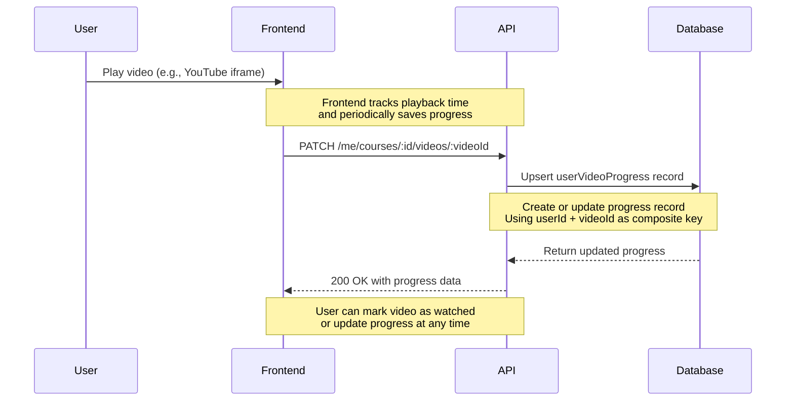

# Video Progress Flow

## Overview

This flow describes how users track their progress watching videos.



## Step-by-Step

### 1. User Watches Video

The frontend embeds YouTube videos and tracks progress:

```typescript
// Frontend (React example)
import { useEffect, useState } from 'react'

function VideoPlayer({ courseId, videoId }: { courseId: string; videoId: string }) {
  const [progress, setProgress] = useState({ watched: false, progressSecs: 0 })
  
  // Load saved progress on mount
  useEffect(() => {
    const loadProgress = async () => {
      const response = await fetch(
        `http://localhost:3000/me/courses/${courseId}/videos/${videoId}`,
        {
          headers: { Authorization: `Bearer ${clerkJwtToken}` }
        }
      )
      const data = await response.json()
      if (data.success && data.data.userProgress?.[0]) {
        setProgress(data.data.userProgress[0])
      }
    }
    loadProgress()
  }, [courseId, videoId])
  
  // Save progress periodically
  useEffect(() => {
    const interval = setInterval(async () => {
      await fetch(
        `http://localhost:3000/me/courses/${courseId}/videos/${videoId}`,
        {
          method: 'PATCH',
          headers: {
            Authorization: `Bearer ${clerkJwtToken}`,
            'Content-Type': 'application/json'
          },
          body: JSON.stringify({
            watched: progress.watched,
            progressSecs: progress.progressSecs
          })
        }
      )
    }, 30000) // Save every 30 seconds
    
    return () => clearInterval(interval)
  }, [courseId, videoId, progress])
  
  const handleVideoEnd = () => {
    setProgress({ watched: true, progressSecs: 0 })
  }
  
  return (
    <div>
      {/* YouTube iframe */}
      <YouTube videoId={videoId} onEnd={handleVideoEnd} />
      
      {/* Progress indicator */}
      <div>Progress: {progress.progressSecs}s</div>
      {progress.watched && <span>✓ Watched</span>}
    </div>
  )
}
```

### 2. API Updates Progress

```typescript
// src/services/userVideoService.ts
export async function upsertVideoProgress(
  clerkUserId: string,
  courseId: string,
  videoId: string,
  data: { watched?: boolean; progressSecs?: number }
) {
  const db = getPrismaClient()
  
  // Verify video is in course
  const courseVideo = await db.courseVideo.findFirst({
    where: { courseId, videoId }
  })
  
  if (!courseVideo) {
    throw new Error('Video not found in course')
  }
  
  // Get user by clerkUserId
  const user = await db.user.findUniqueOrThrow({
    where: { clerkUserId }
  })
  
  // Upsert progress record
  return db.userVideoProgress.upsert({
    where: {
      userId_videoId: { userId: user.id, videoId }
    },
    update: {
      watched: data.watched ?? false,
      progressSecs: data.progressSecs ?? 0
    },
    create: {
      userId: user.id,
      videoId,
      watched: data.watched ?? false,
      progressSecs: data.progressSecs ?? 0
    }
  })
}
```

### 3. Check Video Access

Before allowing video playback, verify user has access:

```typescript
// src/services/userVideoService.ts
export async function userHasAccessToVideo(
  clerkUserId: string,
  videoId: string
): Promise<boolean> {
  const courseVideo = await db.courseVideo.findFirst({
    where: {
      videoId,
      course: {
        isPublished: true,
        planCourses: {
          some: {
            plan: {
              subscriptions: {
                some: activeSubscriptionFilter(clerkUserId)
              }
            }
          }
        }
      }
    }
  })
  
  return courseVideo !== null
}
```

## Query Breakdown

### Upsert Progress (Create or Update)

```prisma
# SQL equivalent
INSERT INTO user_video_progress (user_id, video_id, watched, progress_secs)
VALUES ('<user-id>', '<video-id>', false, 60)
ON CONFLICT (user_id, video_id) DO UPDATE
SET watched = EXCLUDED.watched,
    progress_secs = EXCLUDED.progress_secs
RETURNING *
```

### Check Video Access

```prisma
# SQL equivalent
SELECT cv.*
FROM course_videos cv
INNER JOIN courses c ON cv.course_id = c.id
INNER JOIN plan_courses pc ON c.id = pc.course_id
INNER JOIN plans p ON pc.plan_id = p.id
INNER JOIN subscriptions s ON p.id = s.plan_id
WHERE cv.video_id = '<video-id>'
  AND c.is_published = true
  AND s.status IN ('active', 'trialing')
  AND s.current_period_start <= NOW()
  AND s.current_period_end >= NOW()
```

## Request/Response Examples

### Update Video Progress

**Request**:
```bash
curl -X PATCH -H "Authorization: Bearer <clerk-jwt-token>" \
  "http://localhost:3000/me/courses/a1b2c3d4-e5f6-7890-abcd-ef1234567890/videos/c3d4e5f6-a7b8-9012-cdef-123456789012" \
  -H "Content-Type: application/json" \
  -d '{
    "watched": false,
    "progressSecs": 60
  }'
```

**Response (200 OK)**:
```json
{
  "success": true,
  "data": {
    "userId": "a1b2c3d4-e5f6-7890-abcd-ef1234567890",
    "videoId": "c3d4e5f6-a7b8-9012-cdef-123456789012",
    "watched": false,
    "progressSecs": 60,
    "updatedAt": "2026-06-20T10:35:00.000Z"
  }
}
```

### Mark Video as Watched

**Request**:
```bash
curl -X PATCH -H "Authorization: Bearer <clerk-jwt-token>" \
  "http://localhost:3000/me/courses/a1b2c3d4-e5f6-7890-abcd-ef1234567890/videos/c3d4e5f6-a7b8-9012-cdef-123456789012" \
  -H "Content-Type: application/json" \
  -d '{
    "watched": true,
    "progressSecs": 0
  }'
```

**Response (200 OK)**:
```json
{
  "success": true,
  "data": {
    "userId": "a1b2c3d4-e5f6-7890-abcd-ef1234567890",
    "videoId": "c3d4e5f6-a7b8-9012-cdef-123456789012",
    "watched": true,
    "progressSecs": 0,
    "updatedAt": "2026-06-20T10:45:00.000Z"
  }
}
```

### Get Video Progress

**Request**:
```bash
curl -H "Authorization: Bearer <clerk-jwt-token>" \
  "http://localhost:3000/me/courses/a1b2c3d4-e5f6-7890-abcd-ef1234567890/videos/c3d4e5f6-a7b8-9012-cdef-123456789012"
```

**Response (200 OK)**:
```json
{
  "success": true,
  "data": {
    "courseId": "a1b2c3d4-e5f6-7890-abcd-ef1234567890",
    "videoId": "c3d4e5f6-a7b8-9012-cdef-123456789012",
    "position": 1,
    "video": {
      "id": "c3d4e5f6-a7b8-9012-cdef-123456789012",
      "title": "Getting Started",
      "url": "https://youtube.com/watch?v=abc123",
      "thumbnail": "https://example.com/thumb.jpg",
      "createdAt": "2026-06-19T08:00:00.000Z",
      "updatedAt": "2026-06-19T08:00:00.000Z",
      "userProgress": [
        {
          "userId": "a1b2c3d4-e5f6-7890-abcd-ef1234567890",
          "videoId": "c3d4e5f6-a7b8-9012-cdef-123456789012",
          "watched": true,
          "progressSecs": 0,
          "updatedAt": "2026-06-20T10:45:00.000Z"
        }
      ]
    }
  }
}
```

## Error Cases

**403 Forbidden** - User doesn't have access to course:
```json
{
  "success": false,
  "error": "Forbidden"
}
```

**403 Forbidden** - Video not in course:
```json
{
  "success": false,
  "error": "Video not found in course"
}
```

**400 Bad Request** - Missing progress field:
```json
{
  "success": false,
  "error": "At least one of watched or progressSecs must be provided"
}
```

## Best Practices

1. **Debounce updates**: Save progress every 30 seconds, not on every change
2. **Handle offline**: Store progress locally and sync when online
3. **Clear on complete**: Reset `progressSecs` to 0 when `watched: true`
4. **Error handling**: Retry failed progress updates