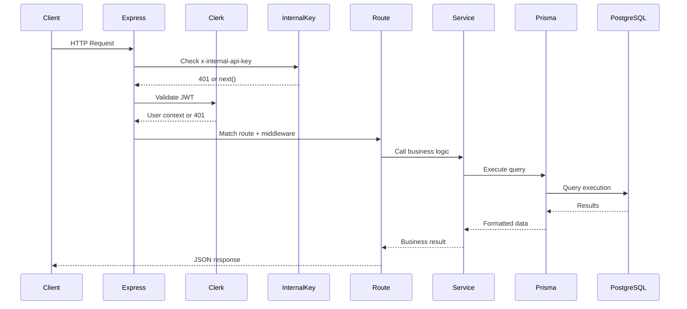
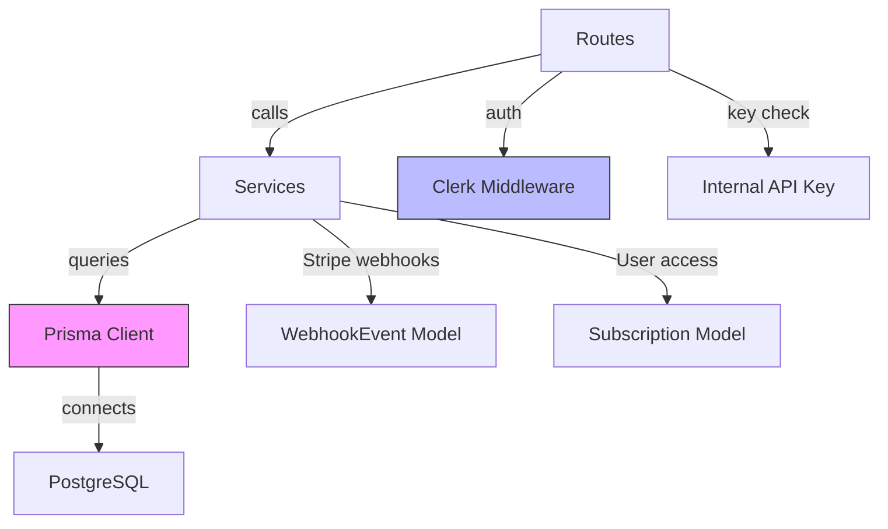

# Architecture

This application follows a **layered architecture** pattern, separating concerns into distinct layers for maintainability and testability.

## Layer Structure

```
┌─────────────────────────────────────────────────────────────┐
│                     Client (Frontend)                       │
└─────────────────────────────────────────────────────────────┘
                            ↓ HTTP/JSON
┌─────────────────────────────────────────────────────────────┐
│                    Routes Layer                             │
│  - Parse & validate request (Zod)                          │
│  - Call appropriate service                                │
│  - Return JSON response                                    │
└─────────────────────────────────────────────────────────────┘
                            ↓
┌─────────────────────────────────────────────────────────────┐
│                    Services Layer                           │
│  - Business logic                                          │
│  - Database queries (Prisma)                               │
│  - Cross-model operations                                  │
└─────────────────────────────────────────────────────────────┘
                            ↓
┌─────────────────────────────────────────────────────────────┐
│                    Database Layer                           │
│  - Prisma Client (single instance)                         │
│  - PostgreSQL connection pool                              │
└─────────────────────────────────────────────────────────────┘
```

## Request Flow



## Layer Responsibilities

### Routes (`src/routes/`)
- Parse and validate request parameters/body using Zod schemas
- Extract authentication context from Clerk middleware
- Call appropriate service functions
- Return standardized JSON responses
- **No database imports allowed**

### Services (`src/services/`)
- Implement business logic
- Perform all Prisma database queries
- Handle cross-model operations
- Return domain objects (not HTTP responses)
- **No Express req/res references**

### Database (`src/lib/prisma.ts`)
- Single Prisma client instance (singleton pattern)
- PostgreSQL connection pooling
- Export `getPrismaClient()` for services to use

## Middleware Order

```typescript
// src/app.ts
app.use(express.json({ limit: '100kb' }))
app.use(internalApiKey)           // 1. Internal API key check
app.use(clerkMiddleware())        // 2. Clerk JWT validation
app.use(userRoutes)               // 3. Route handlers
app.use(planRoutes)
app.use(courseRoutes)
app.use(meRoutes)
```

**Important**: Raw-body routes (e.g., Stripe webhooks) must be registered before `express.json()` and `internalApiKey`.

## Code Organization

```
src/
├── app.ts                    # Express app setup, middleware registration
├── index.ts                  # Server entry point
├── lib/
│   └── prisma.ts            # Prisma client singleton
├── middleware/
│   └── internalApiKey.ts    # Internal API key validation
├── routes/                  # Route handlers (Express Router)
│   ├── userRoutes.ts
│   ├── planRoutes.ts
│   ├── courseRoutes.ts
│   └── meRoutes.ts
├── services/                # Business logic & database queries
│   ├── userService.ts
│   ├── planService.ts
│   ├── courseService.ts
│   ├── userCoursesService.ts
│   └── userVideoService.ts
└── tests/                   # Test files
    ├── setup.ts
    ├── helpers/api.ts
    ├── integration/
    └── unit/
```

## Dependencies Graph



## Key Principles

1. **Single Responsibility**: Each layer has one clear purpose
2. **Dependency Direction**: Layers only depend on layers below them
3. **No Circular Dependencies**: Services don't import routes
4. **Testability**: Layers can be tested in isolation
5. **Type Safety**: Full TypeScript coverage with Zod validation

## Error Handling Pattern

```typescript
// Routes: Return error response, no try/catch in route handler
router.get('/courses/:id', async (req, res) => {
  const parse = z.uuid().safeParse(req.params.id)
  if (!parse.success) {
    return res.status(400).json({ success: false, error: 'Invalid ID' })
  }
  
  const course = await courseService.getCourseById(parse.data)
  if (!course) return res.status(404).json({ success: false, error: 'Not found' })
  
  res.json({ success: true, data: course })
})

// Services: Throw errors, let routes handle response
export async function getCourseById(id: string) {
  const course = await db.course.findUnique({ where: { id } })
  if (!course) throw new Error('Course not found')
  return course
}
```

## Testing Strategy

- **Unit tests**: Test services in isolation (mock Prisma)
- **Integration tests**: Test routes with full request/response cycle
- **Database tests**: Use testcontainers for PostgreSQL

See [Development Guide](./development.md) for testing instructions.