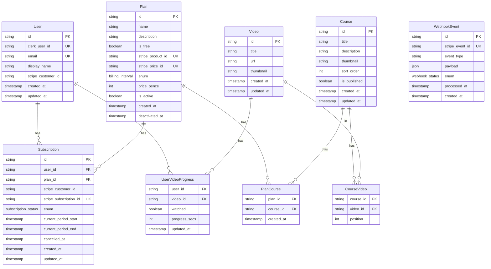

# Database Schema

## Entity Relationship Diagram

## Models

### User

Represents a user in the system, linked to Clerk authentication.

| Field | Type | Description |
|-------|------|-------------|
| `id` | String (UUID) | Primary key |
| `clerk_user_id` | String | Clerk user ID, unique |
| `email` | String | User's email, unique |
| `display_name` | String? | Optional display name |
| `stripe_customer_id` | String? | Stripe customer reference |
| `created_at` | DateTime | Creation timestamp (timestamptz) |
| `updated_at` | DateTime | Last update timestamp (timestamptz) |

**Indexes**: `email`, `clerk_user_id`, `stripe_customer_id`

---

### Plan

Subscription plans with Stripe integration.

| Field | Type | Description |
|-------|------|-------------|
| `id` | String (UUID) | Primary key |
| `name` | String | Plan name |
| `description` | String? | Optional description |
| `is_free` | Boolean | Free plan flag (default: false) |
| `stripe_product_id` | String? | Stripe product reference, unique |
| `stripe_price_id` | String? | Stripe price reference, unique |
| `billing_interval` | Enum | `month` or `year` |
| `price_pence` | Int? | Price in pence (null for free plans) |
| `is_active` | Boolean | Active plan flag (default: true) |
| `created_at` | DateTime | Creation timestamp |
| `deactivated_at` | DateTime? | Deactivation timestamp |

**Enums**: `BillingInterval { month, year }`

---

### Course

Published courses containing video content.

| Field | Type | Description |
|-------|------|-------------|
| `id` | String (UUID) | Primary key |
| `title` | String | Course title |
| `description` | String? | Optional description |
| `thumbnail` | String? | Thumbnail URL |
| `sort_order` | Int | Display order (default: 0) |
| `is_published` | Boolean | Published flag (default: false) |
| `created_at` | DateTime | Creation timestamp |
| `updated_at` | DateTime | Last update timestamp |

---

### Video

Video content linked to courses.

| Field | Type | Description |
|-------|------|-------------|
| `id` | String (UUID) | Primary key |
| `title` | String | Video title |
| `url` | String | Video URL (YouTube, etc.) |
| `thumbnail` | String | Thumbnail URL |
| `created_at` | DateTime | Creation timestamp |
| `updated_at` | DateTime | Last update timestamp |

---

### Subscription

Links users to plans with Stripe subscription tracking.

| Field | Type | Description |
|-------|------|-------------|
| `id` | String (UUID) | Primary key |
| `user_id` | String | Foreign key to User |
| `plan_id` | String | Foreign key to Plan |
| `stripe_customer_id` | String? | Stripe customer reference |
| `stripe_subscription_id` | String? | Stripe subscription ID, unique |
| `status` | Enum | Subscription status |
| `current_period_start` | DateTime? | Current billing period start |
| `current_period_end` | DateTime? | Current billing period end |
| `cancelled_at` | DateTime? | Cancellation timestamp |
| `created_at` | DateTime | Creation timestamp |
| `updated_at` | DateTime | Last update timestamp |

**Enums**: `SubscriptionStatus { active, trialing, past_due, cancelled, incomplete, incomplete_expired, unpaid }`

**Indexes**: `user_id`, `status`

---

### PlanCourse (Join Table)

Many-to-many relationship between Plans and Courses.

| Field | Type | Description |
|-------|------|-------------|
| `plan_id` | String | Foreign key to Plan (part of PK) |
| `course_id` | String | Foreign key to Course (part of PK) |
| `created_at` | DateTime | Creation timestamp |

**Composite Primary Key**: `(plan_id, course_id)`

---

### CourseVideo (Join Table)

Many-to-many relationship between Courses and Videos with position ordering.

| Field | Type | Description |
|-------|------|-------------|
| `course_id` | String | Foreign key to Course (part of PK) |
| `video_id` | String | Foreign key to Video (part of PK) |
| `position` | Int | Order within course |

**Composite Primary Key**: `(course_id, video_id)`

---

### UserVideoProgress

Tracks individual user's progress on videos.

| Field | Type | Description |
|-------|------|-------------|
| `user_id` | String | Foreign key to User (part of PK) |
| `video_id` | String | Foreign key to Video (part of PK) |
| `watched` | Boolean | Watch completion flag (default: false) |
| `progress_secs` | Int | Current watch position in seconds (default: 0) |
| `updated_at` | DateTime | Last update timestamp |

**Composite Primary Key**: `(user_id, video_id)`

---

### WebhookEvent

Stripe webhook event tracking.

| Field | Type | Description |
|-------|------|-------------|
| `id` | String (UUID) | Primary key |
| `stripe_event_id` | String | Stripe event ID, unique |
| `event_type` | String | Event type (e.g., "checkout.session.completed") |
| `payload` | Json | Raw webhook payload (JSONB) |
| `status` | Enum | Processing status |
| `processed_at` | DateTime? | Timestamp when processed |
| `created_at` | DateTime | Creation timestamp |

**Enums**: `WebhookStatus { pending, processed, failed }`

**Indexes**: `status`

## Database Constraints

### Foreign Keys

- `Subscription.user_id` → `User.id`
- `Subscription.plan_id` → `Plan.id`
- `PlanCourse.plan_id` → `Plan.id`
- `PlanCourse.course_id` → `Course.id`
- `CourseVideo.course_id` → `Course.id`
- `CourseVideo.video_id` → `Video.id`
- `UserVideoProgress.user_id` → `User.id`
- `UserVideoProgress.video_id` → `Video.id`

### Unique Constraints

- `User.clerk_user_id`
- `User.email`
- `Plan.stripe_product_id`
- `Plan.stripe_price_id`
- `WebhookEvent.stripe_event_id`
- `Subscription.stripe_subscription_id`

## Seeding

See [`prisma/seed.ts`](../prisma/seed.ts) for sample data including:
- Test users (Alice, ppywmjr)
- Sample videos
- Free plan with course access
- Subscription linking user to plan

Run seed: `npx prisma db seed`